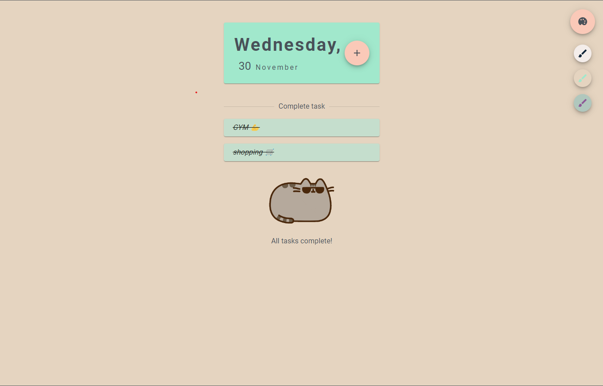

# Tasks planner

This project was bootstrapped with [Create React App](https://github.com/facebook/create-react-app).

## About

Simple task planner.

Technologies:
* typescript
* react,
* jss,
* material ui,
* eslint

## DEMO

### No tasks view:

### One task view and input visible:

### Complete task view:

### All tasks complete view:

### Other theme view:

